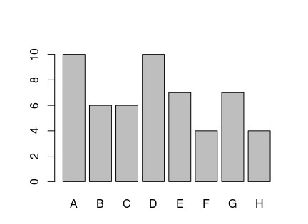

#Statistics - Basic
Lets get started with some of the basic quantitative stats. These are frequency, cummulative frequency, mean, median, mode, standard deviation.

Lets pick up some data available out of the box.


> library(MASS)
> painters
                Composition Drawing Colour Expression School
Da Udine                 10       8     16          3      A
Da Vinci                 15      16      4         14      A
Del Piombo                8      13     16          7      A
Del Sarto                12      16      9          8      A
Fr. Penni                 0      15      8          0      A
.....
...


##Frequency Distribution
Lets find out categories in School column


> levels(painters$School)
[1] "A" "B" "C" "D" "E" "F" "G" "H"


Also, checkout values stored in school, as a variable

> painters$School
> [1] A A A A A A A A A A B B B B B B C C C C C C D D D D D D D D D D E E E E E E
[39] E F F F F G G G G G G G H H H H


To find occurence of all levels


> table(painters$School)

 A  B  C  D  E  F  G  H 
10  6  6 10  7  4  7  4 
> 


``table`` command summarizes the levels within data.

##Relative Frequency
How much as a percentage a particular level occurs amongst all data points.


> table(painters$School) / length(painters$School)

         A          B          C          D          E          F          G 
0.18518519 0.11111111 0.11111111 0.18518519 0.12962963 0.07407407 0.12962963 
         H 
0.07407407 
> 


To limit the digits in result, we can


> options(digits=2)
> table(painters$School) / length(painters$School)

    A     B     C     D     E     F     G     H 
0.185 0.111 0.111 0.185 0.130 0.074 0.130 0.074 
> 


##Bar Graph
We can plot the above frequency table.


> barplot(table(painters$School))
> #adding colors
> barplot(table(painters$School), col=c("red", "yellow"))


Both the graphs are given below side by side.

##Pie Chart
Similarly we can plot pie chart using ``pie()`` function


> pie(table(painters$School), col=c("red", "blue"))


##Finding mean of every level (use of: tapply)
**``tapply``** can be used to apply different stats function data corresponding to every level. It is a worker provided for every category.


> tapply(painters$Composition, painters$School, mean)
   A    B    C    D    E    F    G    H 
10.4 12.2 13.2  9.1 13.6  7.2 13.9 14.0 
> barplot(tapply(painters$Composition, painters$School, mean), col=c("red", "yellow"))
> 


##Working with continous data
In above example, what we got as mean is an example of such information. Variable does not take any discrete values. Here variable is the mean and not the "Composition". For such types, how to calculate frequency distribution.

Lets use data frame ``faithful`` here


> faithful
> head(faithful)
  eruptions waiting
1       3.6      79
2       1.8      54
3       3.3      74
4       2.3      62


Here both eruptions and waiting may be classified as continous data.

To find range in which the variable varies, use function **``range()``**


> range(faithful$eruptions)
[1] 1.6 5.1
> range(faithful$waiting)
[1] 43 96
> 


Lets create an vector with equi-distant points between the range retrieved in previous example


> breaks = seq(range(faithful$eruptions)[1]-0.5, range(faithful$eruptions)[2]+.5, by=0.5)
> breaks
 [1] 1.1 1.6 2.1 2.6 3.1 3.6 4.1 4.6 5.1 5.6
> 


One can create variable to store ``range(faithful$eruptions)[1]`` and that of upper limit, then reuse it (more readable).

Now, lets use this category sequence (vector), to split data range for eruptions, using **``cut()``**


> eruptions.cat = cut(faithful$eruptions, breaks, right=FALSE)
> eruptions.cat
  [1] [3.6,4.1) [1.6,2.1) [3.1,3.6) [2.1,2.6) [4.1,4.6) [2.6,3.1) [4.6,5.1)
  [8] [3.6,4.1) [1.6,2.1) [4.1,4.6) [1.6,2.1) [3.6,4.1) [4.1,4.6) [1.6,2.1)
 [15] [4.6,5.1) [2.1,2.6) [1.6,2.1) [4.6,5.1) [1.6,2.1) [4.1,4.6) [1.6,2.1)
  ...
  ..
9 Levels: [1.1,1.6) [1.6,2.1) [2.1,2.6) [2.6,3.1) [3.1,3.6) ... [5.1,5.6)
> 


Now, every data point belongs to at least one of the 7 levels (category). Using the tapply, we can calculate the mean

> tapply(faithful$eruptions, eruptions.cat, mean)
[1.1,1.6) [1.6,2.1) [2.1,2.6) [2.6,3.1) [3.1,3.6) [3.6,4.1) [4.1,4.6) [4.6,5.1) 
       NA       1.9       2.3       2.8       3.4       3.9       4.4       4.8 
[5.1,5.6) 
      5.1 


To calculate freq??


> cbind(table(eruptions.cat))
          [,1]
[1.1,1.6)    0
[1.6,2.1)   63
[2.1,2.6)   29
[2.6,3.1)    6
[3.1,3.6)   10
[3.6,4.1)   42
[4.1,4.6)   79
[4.6,5.1)   42
[5.1,5.6)    1
# we used here cbind to combine empty table with column representation of the output
> barplot(table(eruptions.cat), xlab="Duration minutes", ylab="Frequency", main="Faithful Eruptions")
# note here we remove cbind here, otherwise it would have created horizontal bars
# also note here additional arguments given to decorate chart


