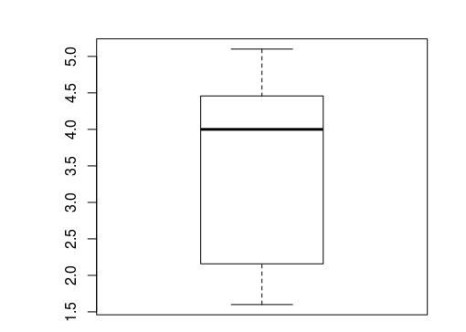

#Data properties
##Mean


> mean(faithful$eruptions)
[1] 3.5


##Median


> median(faithful$eruptions)
[1] 4


##Quartile
Quartile is calculated by distributing the population into 4 equal parts, irrespective of the values contained in that data set. This is done on the sorted data frame.



> quantile(faithful$eruptions)
  0%  25%  50%  75% 100% 
 1.6  2.2  4.0  4.5  5.1 



Values 25% is the instance where it cuts 25% data.

##Percentile
On similar concepts, we can calculate 1/100th parts and hence n parts out of these data portions to contribute to the percentile.

To calculate 69th percentile, one has to find value that separate 69th part of the data from 70th.



> quantile(faithful$eruptions, .69)
69% 
4.3 
> quantile(faithful$eruptions, c(.69,.22))
69% 22% 
4.3 2.1 
> 



##Inter Quartile Range
Difference between 25% and 75% range of the data



> quantile(faithful$eruptions)
  0%  25%  50%  75% 100% 
 1.6  2.2  4.0  4.5  5.1 
> IQR(faithful$eruptions)
[1] 2.3
> # See 2.3 is the difference between 75% and 25% reading
> 


###Boxplot for analysing above measures
Boxplot captures the spread between 2nd and 3rd quartile (i.e. 25%, 75%).


> boxplot(faithful$eruptions)


Boxplot for eruptions

##Variance
Here one has to take care of the difference between a. Sample b. Population variances.

For our calculations through R, we do


> var(faithful$eruptions)
[1] 1.3


##Standard Deviation
It is square root of variance. In R, we do..


> sd(faithful$eruptions)
[1] 1.1


##Covariance
This gives an indication how two parameters vary w.r.t. each other.


> cov(faithful$eruptions, faithful$waiting)
[1] 14


Positive number indicates eruptions increase as waiting increase.

##Correlation Coefficient
It provides the rate at which two parameters vary given they have +/- covariance. It is calculated by dividing covariance with sd of both the variables. In R, we use **``cor()``**


> cor(faithful$eruptions, faithful$waiting)
[1] 0.9


This number being close to 1, indicates that the two parameters are linear function of each other.

##Skewness, Kurtosis, Central Moment
For these items, we need to load library E1071


#download library from shell prompt
wget https://cran.r-project.org/src/contrib/e1071_1.6-6.tar.gz

#from within R shell
install.packages("~/R/e1071_1.6-6.tar.gz", repos=NULL, type="source")

###Central Moment


2nd order of central moment is same as variance.


> moment(faithful$eruptions, order=3, center=TRUE)
[1] -0.61


###Skewness


> skewness(faithful$eruptions)
[1] -0.41


Negative means, it is skewed towards left.

###Kurtosis


> kurtosis(faithful$eruptions)
[1] -1.5


Negative number indicates flat normal curve, also known as **platykurtic**
Positive number would have meant peaked curve, also known as **leptokurtic**

